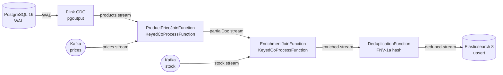
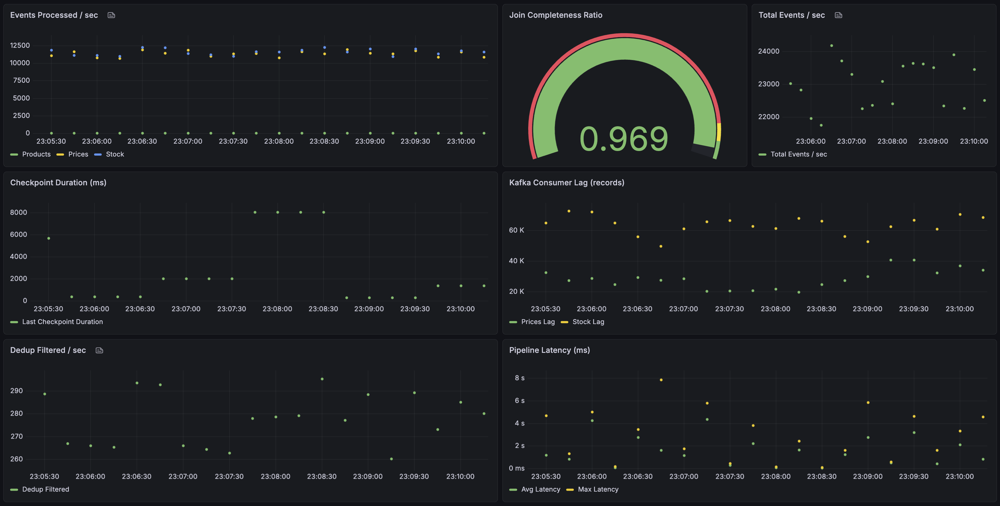

# Real-Time Index Sync Pipeline

Event-driven стриминговый конвейер, который объединяет три независимых источника данных — каталог товаров (PostgreSQL CDC), цены (Kafka) и остатки (Kafka) — и доставляет обогащённые, дедуплицированные документы в поисковый индекс Elasticsearch с **низкой задержкой**.

---

## Архитектура



**Ключевые архитектурные решения:**

| Аспект | Решение |
|---|---|
| 3-way join | Два последовательных `KeyedCoProcessFunction` |
| PostgreSQL CDC | Flink CDC (`PostgresIncrementalSource`) — без Debezium-сервиса |
| Kafka | Apache Kafka в KRaft-режиме — без ZooKeeper |
| Идемпотентность | Сравнение `updatedAt` по ключу; FNV-1a хеш-дедупликация перед записью в ES |
| Частичные документы | Публикуются сразу с полем `completeness` (0.0–1.0); дополняются по мере поступления данных |
| Очистка состояния | TTL-таймеры по processing-time (24 ч) на каждый ключ |
| Отказоустойчивость | Exactly-once чекпоинты Flink каждые 60 с; fixed-delay restart (3 попытки) |

---

## Быстрый старт

```bash
# 1. Собрать JARs и поднять весь стек
./scripts/start.sh

# 2. Проверить состояние сервисов
./scripts/check-health.sh

# 3. Запросить обогащённые документы
curl -s "http://localhost:9200/products/_search?pretty&size=3"

# 4. Открыть дашборд Grafana
open http://localhost:3000/d/rt-index-pipeline/rt-index-sync-pipeline?from=now-5m
```

Остановка:
```bash
./scripts/stop.sh             # сохранить volumes (данные остаются)
docker compose down -v        # удалить все данные
```

---

## Сервисы

| Сервис | Порт | Назначение |
|---|---|---|
| Kafka | 9092 (internal), 29092 (host) | Брокер событий |
| PostgreSQL | 5432 | Каталог товаров + CDC источник |
| Elasticsearch | 9200 | Поисковый индекс |
| Flink JobManager | 8081 | Flink Web UI |
| Prometheus | 9090 | Сбор метрик |
| Grafana | 3000 | Дашборды |

---

## Grafana Dashboard

Автоматически подготавливается на [http://localhost:3000](http://localhost:3000/d/rt-index-pipeline/rt-index-sync-pipeline?from=now-5m) (анонимный доступ с правами Admin).



---

## Сборка и тесты

```bash
# Скомпилировать все модули
./gradlew build

# Юнит-тесты (Flink test harness, без внешних сервисов)
./gradlew :flink-job:test

# Интеграционные тесты (Testcontainers: Kafka + Elasticsearch поднимаются автоматически)
./gradlew :tests:test

# Собрать fat JAR для деплоя
./gradlew :flink-job:shadowJar
# → flink-job/build/libs/rt-index-pipeline.jar
```
